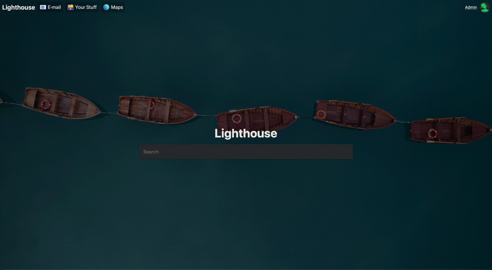
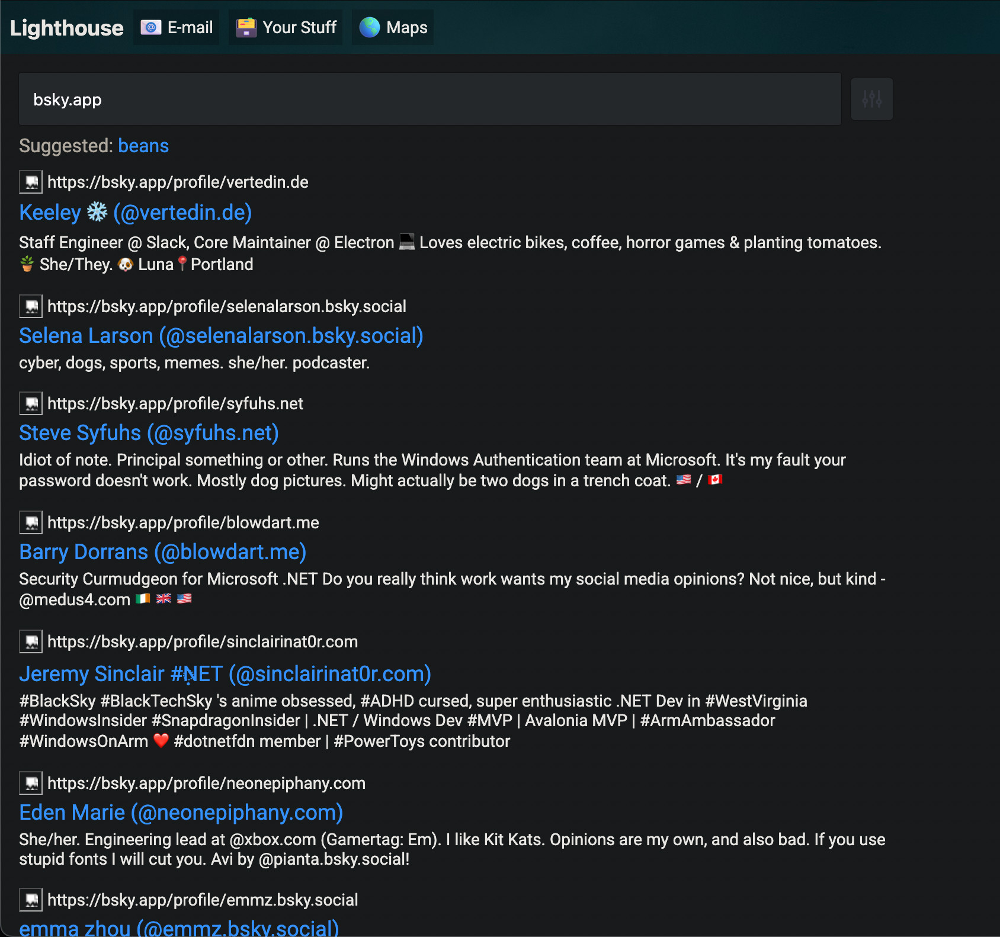
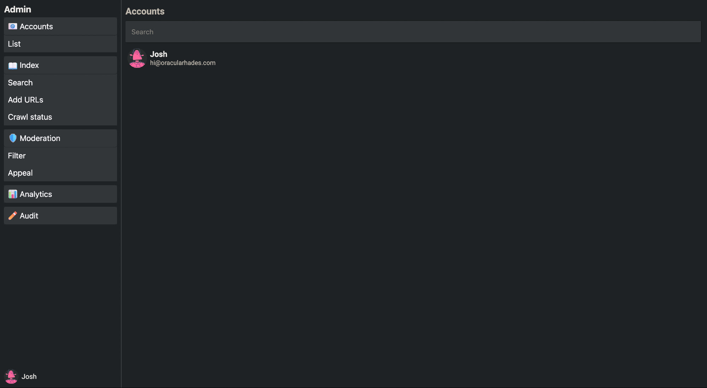

*This repo is very much in-development, but prototype indexing and search works.*

# Lighthouse

With a concern for the freedom of information around the world, vital to healthy democracies, being controlled by a handful of companies ([theguardian.com: Google facilitated Russia and China’s censorship requests](https://www.theguardian.com/world/2025/feb/15/google-helped-facilitate-russia-china-censorship-requests)) - I built Lighthouse, a self-hostable search engine.

The idea is this search engine can be self-hosted by organisations or IT-admins in your local city/country, this guards information from being tampered at scale by financial interests. Lighthouse can also be used on internal intranets, keeping internal information within data governance.

## Dev setup
Instructions for starting Lighthouse (this will change to a configuration file in the near future): [setup.md](/docs/setup.md).

## Screenshots

## Services/packages
- ``server/`` ([Rust](https://www.rust-lang.org/)): Lighthouse main codebase/API.
- ``firefox/extension/page-render`` (Javascript): a Firefox extension used to render pages inside Firefox and send compiled webpages to Lighthouse for indexing.
- ``libraries/npm`` ([Typescript](https://www.typescriptlang.org/)): NPM package for all Lighthouse frontend calls and for third-party developers to easily access Lighthouse APIs using the same code Lighthouse first-party software uses.
- ``frontend/admin`` && ``frontend/lighthouse`` ([Next.js](https://nextjs.org/)): Lighthouse frontends.

## Languages/Frameworks
- [Rust](https://www.rust-lang.org/)
- [Typescript](https://www.typescriptlang.org/)/Javascript/[Node.js](https://nodejs.org/)
- [Elasticsearch](https://www.elastic.co/elasticsearch)
- [Next.js](https://nextjs.org/)
- [Guard](https://github.com/oracularhades/guard)
- [hades-auth](https://github.com/oracularhades/hades-auth)
- [Mariadb](https://mariadb.com/)
- Makefiles are used to build Lighthouse: [makefile](/makefile)

## TODO (before beta)
- Add comprehensive search filters.
- Add E-mail web client/service.
- Add file storage.
- Integrate Openstreetmap into /maps.
- Atprotocol login for federated identity, e.g. cross-server document sharing.
- Finish admin APIs.
- Remove (some) left-over Coastguard code.
- Port new (Lighthouse) config parsing system from other Guard, currently Lighthouse is getting elasticsearch credentials from CLI arguments.
- General code and comment clean-up.
- Deprecate NGINX - it's not required and is only creating additional system dependencies, as we can simply route between the frontends in Rocket (webserver).
- [Guard](https://github.com/oracularhades/guard) integration should be upgraded to use middleware to prevent Guard-related issues from happening on developer machines.